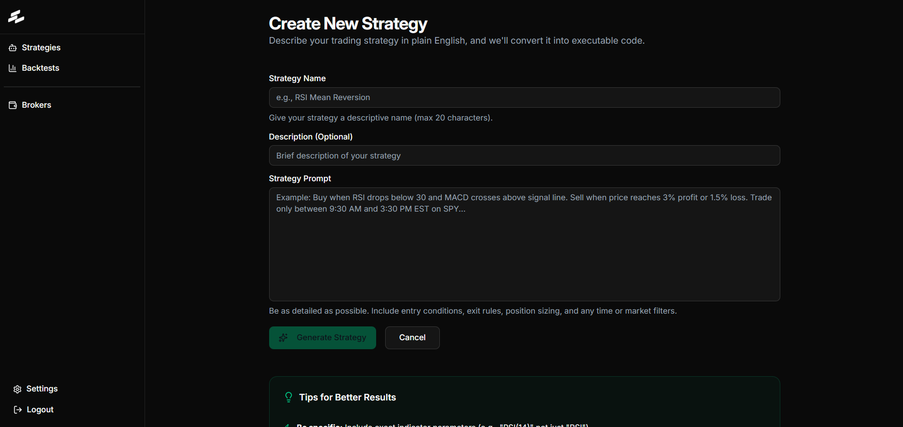
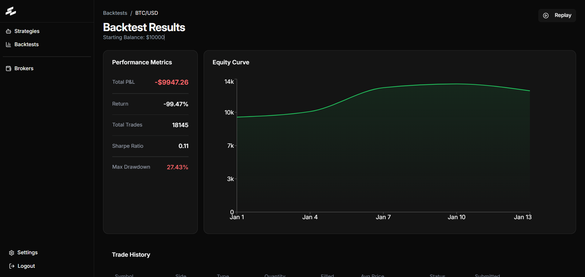
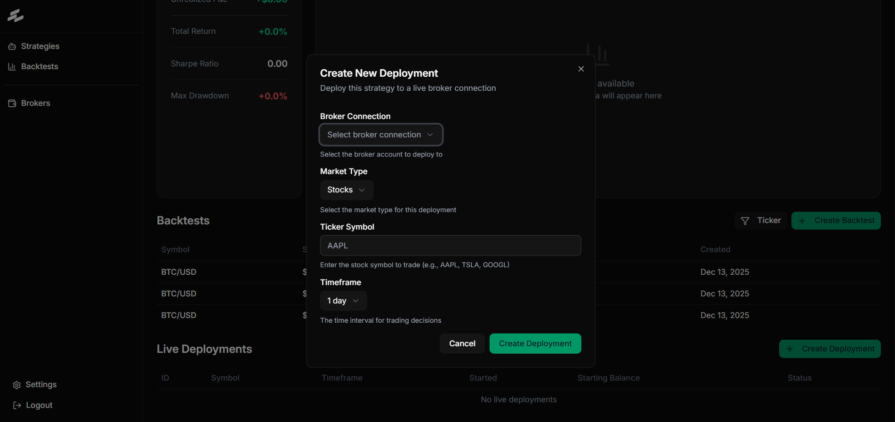
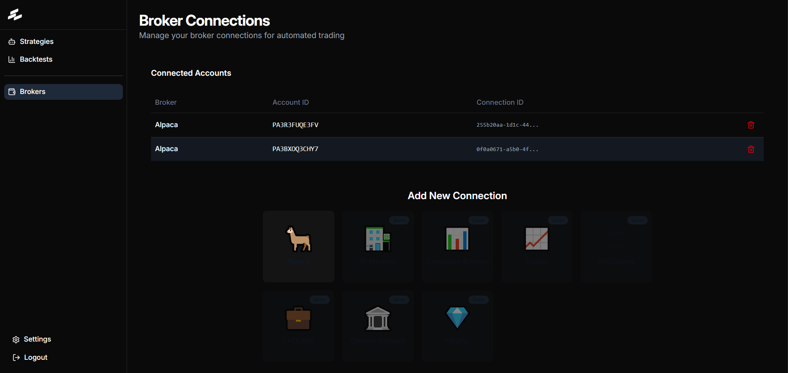

# Vegate - AI-Powered Algorithmic Trading Platform

<p align="center">
  
</p>

**Transform your trading ideas into automated algorithms - no coding required.**

Vegate is a modern web application that empowers traders to describe their trading strategies in plain English and have them automatically converted into executable code. The platform provides comprehensive backtesting capabilities, performance analytics, and seamless deployment to major brokers.

---

## 🌟 Key Features

### 📝 Natural Language Strategy Builder

Describe your trading strategy in plain English - our AI understands complex conditions, technical indicators, and risk management rules.

```
"Buy when the 20-day moving average crosses above the 50-day moving average on SPY.
Set a stop loss at 2% and take profit at 5%. Only trade during market hours."
```

The AI automatically converts this into production-ready trading code with proper error handling and risk management.



### 📊 Advanced Backtesting Engine

Test your strategies against years of historical market data with realistic modeling:

- Tick-level historical data accuracy
- Multi-asset strategy support
- Custom date range selection



### 🚀 Live Deployment

Deploy strategies directly to your broker accounts:

- **Supported Brokers**: Alpaca (live), IG Markets (coming soon), Interactive Brokers (coming soon)
- Real-time order execution
- Live performance monitoring
- Instant start/stop controls
- Secure OAuth authentication



### 📈 Performance Analytics

Track every metric that matters:

- Real-time equity curves
- P&L tracking (realized and unrealized)
- Win rate and profit factor
- Risk metrics (Sharpe ratio, max drawdown, volatility)
- Trade-by-trade execution logs
- Monthly returns heatmaps


### 🔐 Broker Integration

Secure connection management for multiple broker accounts:

- OAuth 2.0 authentication
- Encrypted credential storage
- Paper trading support
- Multi-account management
- Read-only access for safety



---

## 🛠️ Technology Stack

### Frontend Framework

- **React 19** - Modern UI library with hooks
- **TypeScript** - Type-safe development
- **Vite** - Lightning-fast build tool and dev server
- **React Router v7** - Client-side routing

### UI Components & Styling

- **Tailwind CSS v4** - Utility-first CSS framework
- **Radix UI** - Accessible component primitives
- **Lucide React** - Beautiful icon library
- **shadcn/ui** - Reusable component patterns

### Data Management

- **TanStack Query (React Query)** - Server state management
- **Zustand** - Client state management
- **React Hook Form** - Form handling with validation
- **Zod** - Schema validation

### Charting & Visualization

- **Lightweight Charts** - High-performance candlestick charts
- **Recharts** - Responsive chart library for analytics

---

## 📁 Project Structure

```
vegate-frontend/
├── src/
│   ├── assets/              # Images, logos, static assets
│   ├── components/
│   │   ├── layouts/         # Layout components (dashboard, auth, marketing)
│   │   ├── ui/              # Reusable UI components (shadcn/ui)
│   │   ├── equity-graph.tsx
│   │   ├── live-logs.tsx
│   │   ├── performance-metrics.tsx
│   │   └── ...
│   ├── hooks/
│   │   ├── queries/         # React Query hooks (auth, strategies, backtests)
│   │   └── ...              # Custom hooks (pagination, mobile detection)
│   ├── lib/
│   │   ├── query/           # Query client configuration
│   │   ├── utils/           # Utility functions
│   │   └── custom-fetch.ts  # API fetch wrapper
│   ├── pages/               # Route pages
│   │   ├── LandingPage.tsx
│   │   ├── StrategiesPage.tsx
│   │   ├── StrategyCreatePage.tsx
│   │   ├── StrategyDetailPage.tsx
│   │   ├── BacktestsPage.tsx
│   │   ├── BacktestResultsPage.tsx
│   │   ├── LiveDeploymentPage.tsx
│   │   ├── BrokersPage.tsx
│   │   └── ...
│   ├── stores/              # Zustand stores
│   ├── App.tsx              # Main app component with routing
│   ├── main.tsx             # Application entry point
│   ├── openapi.ts           # Generated API types and hooks
│   └── index.css            # Global styles
├── public/                  # Static public assets
├── docs/                    # Documentation and images
│   └── images/              # Screenshots for README
├── .env.example             # Environment variables template
├── package.json             # Dependencies and scripts
├── tsconfig.json            # TypeScript configuration
├── vite.config.ts           # Vite configuration
├── orval.config.ts          # API code generation config
└── tailwind.config.ts       # Tailwind configuration
```

---

## 🚀 Getting Started

### Prerequisites

- Node.js 18+ and npm
- Access to the Vegate backend API

### Installation

1. **Clone the repository**

```bash
git clone https://github.com/your-org/vegate-frontend.git
cd vegate-frontend
```

2. **Install dependencies**

```bash
npm install
```

3. **Configure environment variables**

```bash
cp .env.example .env.development
```

Edit `.env.development` with your backend API URL:

```env
VITE_API_BASE_URL=http://localhost:8000
```

4. **Start the development server**

```bash
npm run dev
```

The application will be available at `http://localhost:5900`

### Build for Production

```bash
npm run build
```

The optimized production build will be in the `dist/` directory.

---

## 🔌 API Integration

The frontend communicates with the Vegate backend API for all data operations. API types and hooks are automatically generated from the OpenAPI specification using Orval.

### Generate API Client

```bash
npm run orval:openapi
```

This generates TypeScript types and React Query hooks in `src/openapi.ts` based on the backend's OpenAPI spec.

### API Hooks Examples

```typescript
// Fetch all strategies
const { data: strategies } = useStrategySummariesQuery({ skip: 0, limit: 10 });

// Create a new strategy
const createMutation = useCreateStrategy();
createMutation.mutate({ name: "My Strategy", prompt: "..." });

// Run a backtest
const backtestMutation = useRunBacktest();
backtestMutation.mutate({ strategy_id: "...", symbol: "SPY", ... });

// Deploy strategy live
const deployMutation = useDeployStrategy();
deployMutation.mutate({ strategy_id: "...", broker_connection_id: "..." });
```

---

## 📱 Core User Flows

### 1. Creating a Strategy

1. Navigate to **Strategies** → **New Strategy**
2. Enter strategy name and description
3. Describe your trading logic in natural language
4. Click **Generate Strategy**
5. AI converts your description to executable code
6. Review and save the strategy

### 2. Backtesting

1. Open a strategy from the **Strategies** page
2. Click **Run Backtest**
3. Configure parameters (symbol, date range, starting balance)
4. Review backtest results with detailed metrics
5. Analyze performance using equity curves and trade history
6. Use **Replay Mode** to visualize trades on charts

### 3. Live Deployment

1. Connect a broker account in **Broker Connections**
2. Select a strategy and click **Deploy Live**
3. Choose broker connection and configure parameters
4. Monitor real-time performance and logs
5. Stop deployment anytime with one click

---

## 🎨 Design System

The application uses a consistent design system built on Tailwind CSS:

- **Color Palette**: Emerald (primary), Teal, Cyan accents
- **Typography**: System fonts with clear hierarchy
- **Components**: Radix UI primitives with custom styling
- **Dark Mode**: Full dark mode support via theme provider
- **Responsive**: Mobile-first responsive design

---

## 🧪 Development Scripts

```bash
# Start development server (port 5900)
npm run dev

# Build for production
npm run build

# Preview production build
npm run preview

# Lint code
npm run lint

# Generate API client from OpenAPI spec
npm run orval:openapi
```

---

## 🔐 Security Features

- **OAuth 2.0 Authentication**: Secure broker connections
- **Encrypted Credentials**: API keys encrypted at rest
- **No Withdrawal Access**: Trading-only permissions
- **HTTPS Only**: All API communication over HTTPS
- **Token Management**: Automatic token refresh and expiration handling

---

## 🌐 Supported Browsers

- Chrome/Edge (latest 2 versions)
- Firefox (latest 2 versions)
- Safari (latest 2 versions)

---

## 📄 License

This project is proprietary software. All rights reserved.

---

## 🤝 Support

For issues, feature requests, or questions:

- **Email**: support@vegate.com
- **Documentation**: https://docs.vegate.com
- **Discord**: https://discord.gg/vegate

---

## 🚧 Roadmap

- [ ] Interactive Brokers integration
- [ ] TD Ameritrade support
- [ ] Portfolio optimization tools
- [ ] Multi-strategy management
- [ ] Advanced risk analytics
- [ ] Social trading features
- [ ] Mobile app (iOS/Android)

---

**Built with ❤️ by the Vegate Team**
